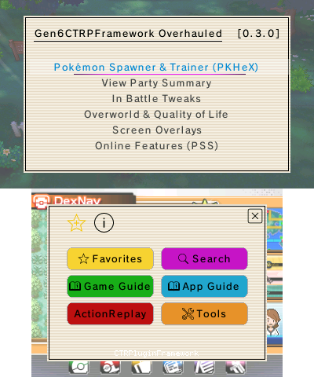
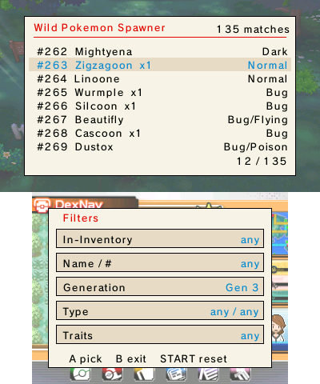
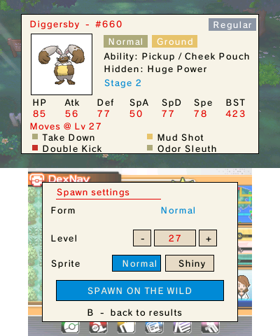
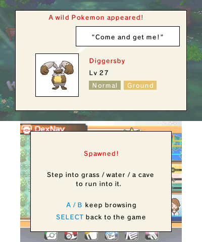
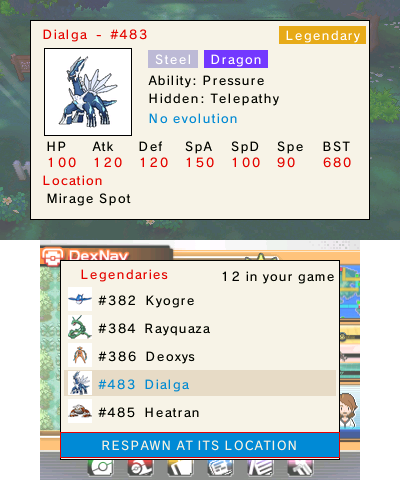

# Gen6CTRPluginFrameworkOverhauled — v0.3.2

A heavily overhauled 3gx plugin for Pokémon X, Y, Omega Ruby, and Alpha Sapphire on the Nintendo 3DS.

**New to modding? This whole thing was built for you.** Gen6CTRPluginFrameworkOverhauled is a fork of
[biometrix76/Gen6CTRPluginFramework](https://github.com/biometrix76/Gen6CTRPluginFramework) that keeps every
feature and wraps it in a friendly, guided experience — so you don't need to be an expert to enjoy it. The
original is itself a continuation of the abandoned
[Multi-Pokémon Framework](https://github.com/semaj14/Multi-PokemonFramework) and the Alolan
CTRPluginFramework; all of that work is gratefully preserved (see Credits).

> 🎯 **This release focuses on Pokémon Alpha Sapphire.** Tailored content for **Pokémon X**, **Y**
> and **Omega Ruby** is already in the works — stay tuned!



## 🆕 New in v0.3.1 — bring your own Poké Mart

**PokéMart Anywhere** turns the item-adder into a real shop: every row shows its icon, how many you own and its
**price**. Press **START** to pick a mode — **FREE** adds anything, any amount, at no cost, while **PAY** narrows
the list to items you can actually buy in-game and charges your **Money**. Buy on the spot, or build a **cart**
and review it all at **Checkout** before you pay (you can never overspend). And **sort** the whole list by name,
price, type or how many you own.

<p align="center">
  
  
  
</p>

**Also new in v0.3.1**

- 🔃 **Sort the bag** — order the list by name, price, type or how many you own, ascending or descending.
- 🌙 **Sleep-safe full-screen tools.** Closing the lid while the Spawner, PokéMart, Party Summary or any other
  full-screen view is open no longer leaves a black screen on wake.
- 🖼️ **Screenshots can keep your overlays** — capture the HUD, enemy stats and notifications too (Tools ›
  Screenshot › *Include overlays*).

## 🔎 The dual-screen finders

Two more built-in **finders** turn "I wish I could just *get* that Pokémon" into a few taps — no internet, no
typing long names, no wikis.

### 🔎 Wild Pokémon Spawner

Browse **every** wild Pokémon on a live, filtered list — narrow by **name / Dex #**, **generation**, **type**
(1st *and* 2nd), **traits** (evo stage, category, Mega) or what you already **own**. Open any result for a full
sheet — sprite, types, abilities (incl. the Hidden one), base stats and the **four moves it knows at your
level** — then set form, level and **Normal / Shiny** and tap **SPAWN ON THE WILD**. Step into grass, water or
a cave, and there it is.

<p align="center">
  
  
  
</p>

### ✨ Respawn Legendary

Knocked one out or watched it flee? Respawn Legendary lists every legendary in your game with its own character
sheet and **real location** — pick it and send it back to where you found it.

<p align="center">
  
</p>

> Plus a **completely re-organised menu**, **save-first guard-rails** on the risky cheats, a **theme-aware
> keyboard**, and lots of polish — see the full changelog in the [release notes](https://github.com/samaBR85/Gen6CTRPluginFramework/releases/latest).

## 🌱 Made by a curious player, with Claude

I'll be upfront: **I'm not a programmer.** I'm a curious player — someone who's good at testing, poking at
things, and thinking hard about problems and how they might be solved. Every feature in this overhaul was
built in back-and-forth ("bate-bola") with Claude Desktop, and I'm not the least bit shy about saying so:
that collaboration is exactly what let me *materialize* the things I kept wishing existed while I played.

Because that's where all of this came from — **real needs, discovered while playing.** I'd be deep in a run,
hit some friction, and think "there should be a way to…", and then we'd go build it. Bit by bit I poured a
little of my own personality into each feature as it took shape. Some of the things I'm proudest of started
as a passing "wouldn't it be cool if…" and turned out to be genuinely possible — like sorting your party by
a stat right inside a card view. I honestly thought that one wouldn't be doable, and the framework turned out
to be robust enough to pull it off. **Parabéns aos criadores** — standing on the shoulders of giants is no
exaggeration here (see Credits).

If you're new to homebrew but you love these games: that's who this is for. Welcome.

## ✨ Features born from real needs

Everything below exists because it solved an actual annoyance — not because a checklist said so.

- 📖 **A built-in App Guide.** 21 short, friendly pages that teach you the plugin *from inside the plugin*,
  sequenced to your real journey through the game — what to do first, what each feature is for, and when it'll
  actually help you. It reads like a guided adventure, not a manual.
- ℹ️ **An INFO (i) note on every single function.** Highlight anything and press the info **(i)** button (or
  **X**) for a plain, beginner-friendly explanation of what it does and how to use it. No guessing, no wikis.
- 🔎 **Dual-screen finders for Pokémon and items.** The **Wild Pokémon Spawner**, **PokéMart Anywhere** and
  **Respawn Legendary** — browse, filter and grab exactly what you want. *(See the highlights above.)*
- 📊 **View Party Summary — sortable stat cards.** See your team's real hidden numbers (stats, IVs, EVs,
  Nature, Ability, item, moves) as cards. Move a selector over a stat with **Up/Down**, press **A** to jump
  to the teammate with the **HIGHER** (or **LOWER**) value, flip the mode with **L**, and read ▲/▼ markers
  that flag your team's best and worst. A battle-decision companion that started as a "this can't be possible"
  idea.

  
- ⭐ **Favorites that actually work for you.** A two-column Favorites list (more on screen, less scrolling),
  **reorder with L + D-Pad** (hold L, tap a direction — because chronological order made re-organizing a pain), and short
  **aliases** shown only in Favorites so the list stays clean and readable.

  
- 🗂️ **Two-column menus** for the toggle-heavy screens, so you scroll a whole lot less.
- 📟 **An on-screen HUD.** Show what matters while you play — Money, Clock, Battle Points, Pokémiles, party
  count, map coordinates, Repel steps, your lead's battle status — in a tidy translucent panel you can
  position and fade to taste.

  
- 🔍 **A "See Enemy Pokémon Stats" overlay.** Reads the foe at a glance — gender, shininess, Nature, Ability
  (including Hidden Abilities), Hidden Power, held item, max HP — plus colour-coded IVs and EVs. Pick exactly
  which fields show, and flip pages mid-battle with **ZR**.

  
  
  
- 🔔 **Friendly on-screen notifications.** A small toast pops up when you turn a cheat on or off, so you always
  know what's active.
- ⚠️ **Gentle guard-rails.** The few cheats that can spoil a beginner's save (Unlock Full Dex, Full Fly Map,
  all TMs/HMs + Key Items) are flagged in a warning colour, and their info opens with a clear **BEWARE / save
  first** note.
- 🎯 **Shortcuts that make sense — and are yours to change.** SELECT opens the menu; **Y** favorites an item,
  **X** shows its info, **START** opens its editor; tap the gamepad icon to rebind any feature's hotkey — all
  customizable in **Tools > Hotkeys**.

  
- 🎨 **25 colour themes.** Make it yours — Trainer Navy, Poké Ball, Game Boy, Zelda BotW, Cyberpunk, Synthwave,
  Persona 5, Hoenn Dreams, Item Bag, Alpha Sapphire and many more. Switches instantly, remembers your choice,
  and previews its colours right next to each name. (An idea I carried over from another app I made.)
- 🧭 **Every menu rewritten and reordered** around clearly named sections — most-used first, each with its own
  short summary — so you always know where to look.
- 🎮 **A built-in Game Guide.** A complete, beginner-friendly Professor Oak Challenge walkthrough for Omega
  Ruby / Alpha Sapphire (by Mewlax — see Credits), bundled to read comfortably on the 3DS screen.
- 🔤 **Proper accents everywhere.** "Pokémon", "Pokédex", "Poké Ball" — written correctly throughout the menus,
  descriptions and guides.

## 🎨 25 colour themes — pick your style

With **25** colour schemes, the whole interface — menus, buttons, even the in-game keyboard — is yours to
restyle. Your choice is remembered, and each theme previews its colours right next to its name. Just a taste
of the range:

<table>
  <tr>
    <td align="center"><br><b>Trainer Navy</b> <i>(default)</i></td>
    <td align="center"><br><b>Game Boy</b></td>
    <td align="center"><br><b>Alpha Sapphire</b></td>
  </tr>
  <tr>
    <td align="center"><br><b>Wild West</b></td>
    <td align="center"><br><b>Pop Art</b></td>
    <td align="center"><br><b>Art Deco</b></td>
  </tr>
</table>

## 📥 Installing
1. Update to the latest [Luma3DS](https://github.com/LumaTeam/Luma3DS/releases/latest).
2. Download the latest [release](https://github.com/samaBR85/Gen6CTRPluginFramework/releases/latest).
3. Extract the `.zip` to the **root of your SD card**, keeping its folder layout. It adds two folders:
   - `luma/` — the plugin itself, at `luma/plugins/000400000011C500/Gen6CTRPluginFramework.3gx` (along with the built-in App Guide and Game Guide).
   - `Gen6CTRPluginFramework/` — the plugin's data, including the **language files** (English, French, German, Italian, Japanese, Spanish). The plugin loads its language from here, so don't skip it. (Your `Theme.txt` and `HUD.txt` settings are created in this folder automatically on first run.)
4. Make sure `Gen6CTRPluginFramework.3gx` is the only `.3gx` file for the title.

> **Note:** The language pack must sit inside the `Gen6CTRPluginFramework` folder at the **root of your SD card**. Make sure the path is exactly:
> `SD:/Gen6CTRPluginFramework/Language/<Language>.txt`
> (for example `SD:/Gen6CTRPluginFramework/Language/English.txt`).

## 🔧 Building
1. Requires `devkitPro`.
2. Open `C:/devkitPro/msys2` and run `msys2_shell.bat`.
3. Add the ThePixellizerOSS repos (paste and run):
   ```sh
   if ! grep -Fxq "[thepixellizeross-lib]" /etc/pacman.conf; then echo -e "\n[thepixellizeross-lib]\nServer = https://thepixellizeross.gitlab.io/packages/any\nSigLevel = Optional" | tee -a /etc/pacman.conf > /dev/null; fi; if ! grep -Fxq "[thepixellizeross-win]" /etc/pacman.conf; then echo -e "\n[thepixellizeross-win]\nServer = https://thepixellizeross.gitlab.io/packages/x86_64/win\nSigLevel = Optional" | tee -a /etc/pacman.conf > /dev/null; fi
   ```
4. Run `pacman -Sy` and confirm the ThePixellizerOSS databases appear.
5. Run `Release.bat` in the plugin directory.

## 🙏 Credits

This project stands on a long line of volunteer work — from the very first ancestor to this fork — and
**every bit of it deserves recognition.** Without this community's freely given effort, none of this would
exist.

**The plugin lineage**
- **Based on** [Gen 6 CTRPluginFramework](https://github.com/biometrix76/Gen6CTRPluginFramework) by
  [biometrix76](https://github.com/biometrix76) — built on
  [Alolan CTRPluginFramework](https://github.com/biometrix76/alolanctrpluginframework/releases/latest)
  and a continuation of the abandoned
  [Multi-Pokémon Framework](https://github.com/semaj14/Multi-PokemonFramework) and
  [its contributors](https://github.com/semaj14/Multi-PokemonFramework/blob/main/Credits.md).

**Foundations & tooling** (preserved from upstream)
- [ThePixellizerOSS](https://gitlab.com/thepixellizeross) et al. — the 3gxtool and CTRPluginFramework used to build plugins
- [PKHeX](https://github.com/kwsch/PKHeX/) (kwsch) et al. — database, documentation, examples, and code
- [AnalogMan151](https://github.com/AnalogMan151) — the ultraSuMoFramework foundation of Alolan CTRPluginFramework
- [dragonfyre173](https://github.com/dragonfyre173) — the in-game data viewer overlay
- [JourneyOver](https://github.com/JourneyOver) et al. — the extensive [ActionReplay code database](https://github.com/JourneyOver/CTRPF-AR-CHEAT-CODES)
- [Alexander Hartmann](https://github.com/Hartie95) — the XY & ORAS foundation of this plugin

**Image & data sources** (for the Spawner, item finder and Pokédex data)
- **Pokémon sprites** — the Spawner sprites and Legendary icons are downscaled from the
  [Pokémon Database](https://pokemondb.net) X/Y sprite set.
- **Item / TM / HM icons** — from the [PokéAPI sprites](https://github.com/PokeAPI/sprites) repository.
- **Pokédex, type, ability & move data** — [Pokémon Showdown](https://github.com/smogon/pokemon-showdown) and
  [PokéAPI](https://pokeapi.co); **item names** from [PKHeX](https://github.com/kwsch/PKHeX/) (kwsch).
- All Pokémon images and names are **© Nintendo / Game Freak / The Pokémon Company.** These community mirrors
  are used only to build this free, non-commercial fan tool.

**The bundled Game Guide** — the Professor Oak Challenge walkthrough
- **Mewlax** ([u/mewlax84](https://www.reddit.com/user/mewlax84), Instagram [@pokemewlax](https://www.instagram.com/pokemewlax/),
  X [@Mewlax1](https://twitter.com/Mewlax1)) — author of the ORAS guide, shared through the
  [r/ProfessorOak](https://www.reddit.com/r/ProfessorOak/) community.
- **Chamale** — first inspired the Professor Oak Challenge back in 2018.
- **Johnstone** and **Chaotic Meatball** — for helping the r/ProfessorOak community grow.
- **Dynamite** — for the O-Power order info; **Likemeon** — for the Granite Cave chaining tip.

**This fork**
- Fork, overhaul and v0.3.0 / v0.3.1 / v0.3.2 additions by [samaBR85](https://github.com/samaBR85), built in collaboration
  with **Claude** (Anthropic).

## License
Licensed under **GNU GPL-3.0**, inherited from upstream. See [LICENSE](LICENSE).
