# Gen6CTRPluginFrameworkOverhauled — v0.5.0

**English** · [Português](README.pt-BR.md)

[](https://ko-fi.com/E5N7227AO5)

A friendly box of superpowers for **Pokémon X, Y, Omega Ruby and Alpha Sapphire** on the Nintendo 3DS.

## What is this?

It's a `.3gx` plugin you drop onto your 3DS that adds a menu over your Pokémon game — spawn any Pokémon, shop
anywhere, edit your team, read your rival mid-battle, play a few mini-games, and a hundred small comforts in between.

The twist: **it was built to be understood.** Every feature is named in plain language, every option has an info
button that explains it, and there's a 23-page guide *inside* the plugin that walks you through it all. The menus
are available in **7 languages**. If you love these games but have never touched homebrew, you're exactly who this
is for.

You open everything with **SELECT**, and the menu appears over your game:

<p align="center">
  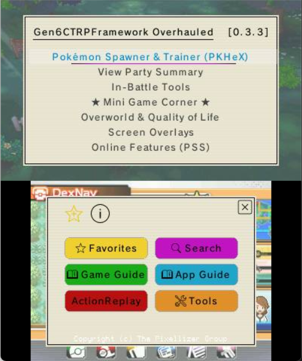
</p>

> 🎯 **Works on all four Gen 6 games.** X, Y, Omega Ruby and Alpha Sapphire each get their own tailored content (guides + assets) in their own Title-ID folder, and the same `.3gx` auto-detects which game you're running.

> 🌐 **Available in 7 languages**, switchable in-plugin: 🇺🇸 English · 🇫🇷 French · 🇩🇪 German · 🇮🇹 Italian · 🇯🇵 Japanese · 🇧🇷 Portuguese (Brazil) · 🇪🇸 Spanish.

## Made by a curious player, with Claude

I'll be upfront: **I'm not a programmer.** I'm a curious player — someone who's good at testing, poking at things,
and thinking hard about a problem and how it might be solved. Every feature here was built in back-and-forth
("bate-bola") with Claude, and I'm not the least bit shy about saying so: that collaboration is exactly what let me
*materialize* the things I kept wishing existed while I played.

Because that's where all of this came from — **real needs, discovered while playing.** I'd be deep in a run, hit
some friction, and think "there should be a way to…", and then we'd go build it. Bit by bit I poured a little of my
own personality into each feature as it took shape. **Parabéns aos criadores** of everything this stands on —
standing on the shoulders of giants is no exaggeration here (see [Credits](#-credits)).

## A guided tour

Here's the plugin roughly in the order you'd meet it. Nothing below is required reading — it's just a friendly
walk through the rooms.

### It starts with one button

Press **SELECT** and the menu opens over your game. Move with the **D-Pad**, choose with **A**, go back with **B**.
The bottom touch screen holds the big buttons — **Favorites**, **Search**, the **Game Guide** and **App Guide**,
**ActionReplay** and **Tools**. Highlight anything and press **X** for its info note, or **Y** to pin it to
Favorites. That's the whole language of the menu.

### Spawn and catch any Pokémon

The **Wild Pokémon Spawner** is a live, filtered list of every species. The top screen shows the matches; the
bottom screen is a filter hub — narrow by name, Dex number, generation, type or what you already own.

<p align="center">
  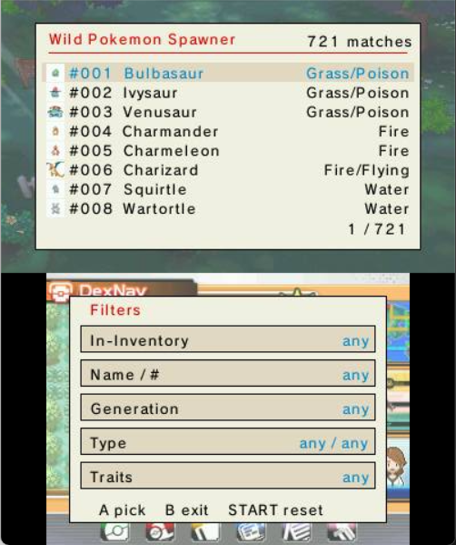
  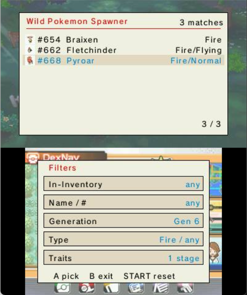
</p>

Open any result for a full sheet — sprite, types, abilities (including the Hidden one), base stats and the four
moves it knows at your level — then set form, level and Normal/Shiny and spawn it into the grass.

<p align="center">
  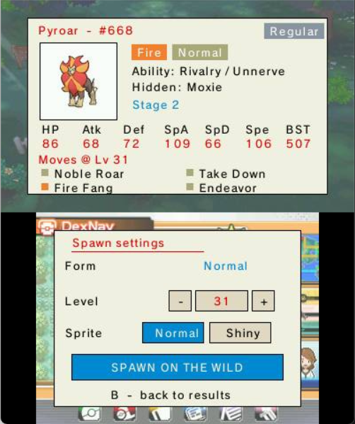
  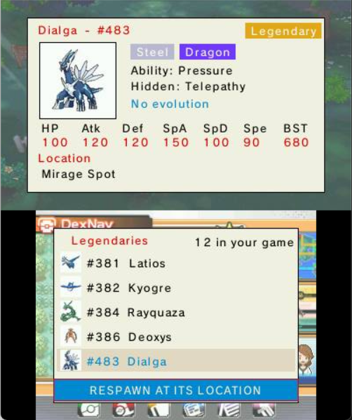
</p>

Knocked out a legendary, or watched one flee? **Respawn Legendary** lists them all with their real locations and
sends the one you pick back where you found it.

### Carry a Poké Mart in your bag

**PokéMart Anywhere** turns the item-adder into a real shop. Choose a mode: **FREE** adds anything, any amount, for
nothing — or **PAY**, a real Poké Mart where the list narrows to what you can actually buy and each item costs your
money.

<p align="center">
  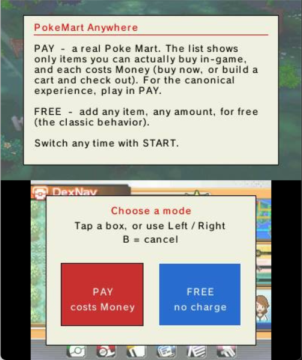
  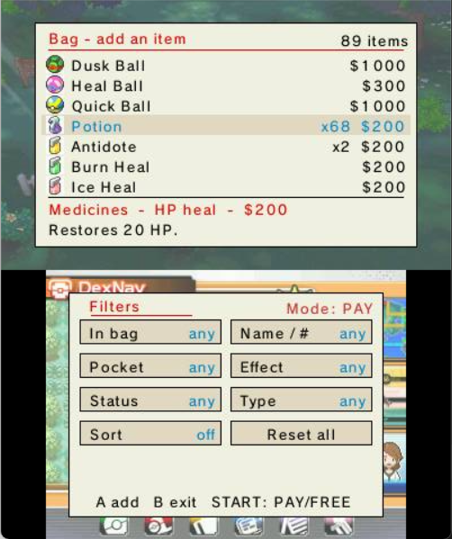
</p>

Buy on the spot, or build a **cart** and review it all at **Checkout** before you pay — you can never overspend.
And sort the whole list by name, price, type or how many you own.

<p align="center">
  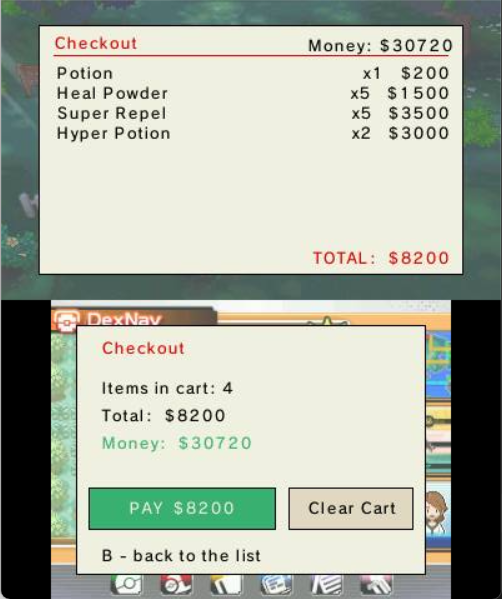
</p>

### Build and rebuild in your boxes

**PC Box ++** is your storage shown as a grid of sprites, just like the in-game PC. Move around with the D-Pad,
change box with L/R, and **move (X)**, **clone (Y)** or **search (START)** right on the grid.

<p align="center">
  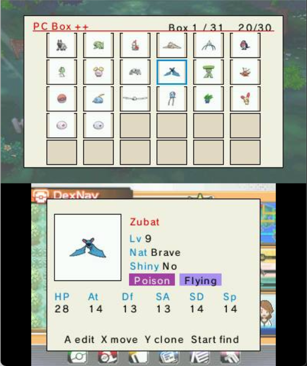
  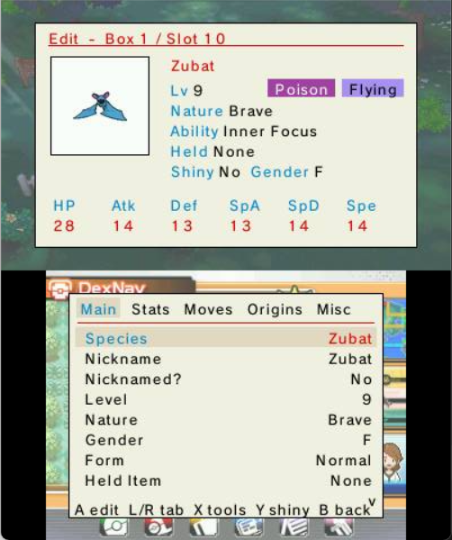
</p>

Press **A** to open the editor, where the details split into tabs — Main, Stats, Moves, Origins, Misc. Every field
(species, IVs/EVs, moves, ability, held item, ball and more) is picked from a tidy on-screen list — no typing, no
keyboard.

<p align="center">
  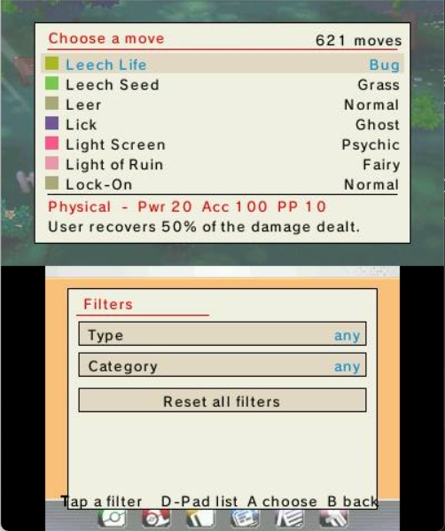
</p>

### Know your team at a glance

**View Party Summary** lays your team out as cards with the real, hidden numbers — stats, IVs, EVs, nature,
ability, item and moves. Slide a selector over a stat and press **A** to jump to the teammate with the highest (or
lowest) value; little ▲/▼ marks flag your team's best and worst.

<p align="center">
  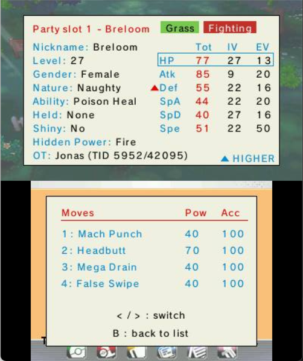
</p>

### Win the battle

The **In-Battle Tools** are the things you reach for mid-fight. **Enemy Helper** is a coach card for the foe — it
explains its ability, item and moves, lists the types that beat it, and compares its six stats against your active
Pokémon (and even tells you whether you already own the species).

<p align="center">
  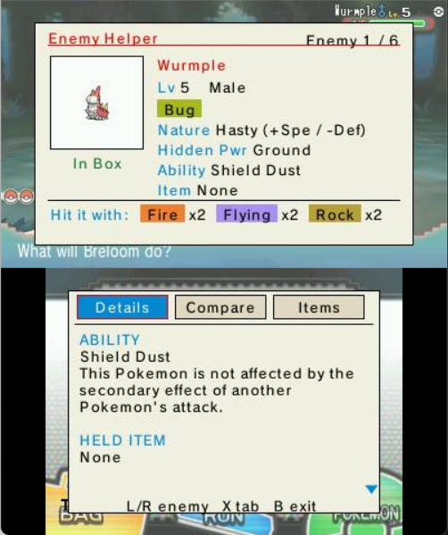
  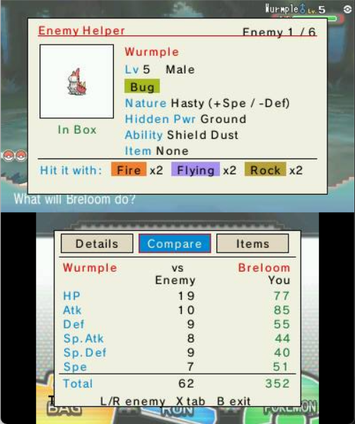
</p>

**Change Party Stats** is a visual editor for your own team, right in the middle of a fight — heal, fix HP/PP,
status, item, moves, or multiply EXP without ever leaving the battle. And **Display Enemy Stats** overlays the
opponent's hidden data on the top screen.

<p align="center">
  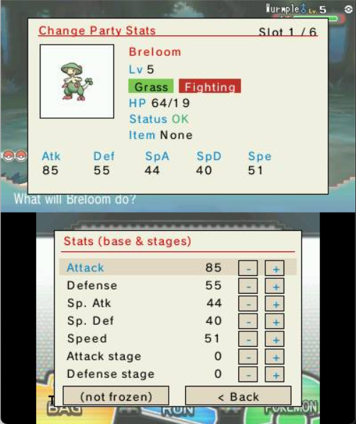
  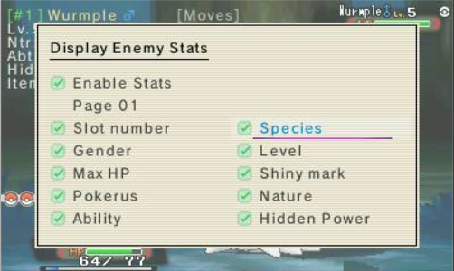
</p>

### Take a break — the Mini Game Corner

When you want to just play, there's a little arcade of seven games. Pick one from the grid; the bottom screen has a
**FREE / PAY** switch (FREE keeps what you win, your money never changes; PAY puts real Pokédollars on the line).

<p align="center">
  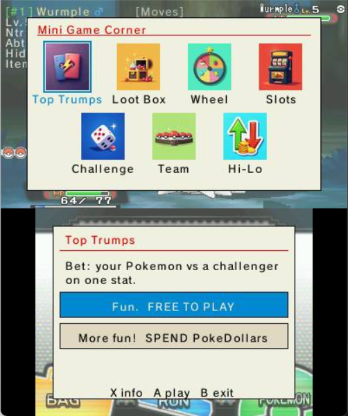
  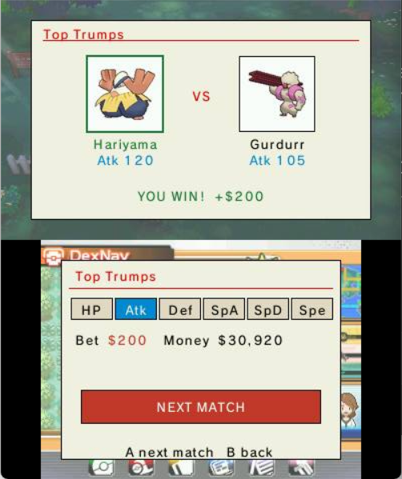
</p>

Open loot boxes, spin a prize wheel, pull the slots, bet on a stat duel, guess higher-or-lower, roll a wild
challenger into your next encounter, or generate a whole random team into an empty box.

<p align="center">
  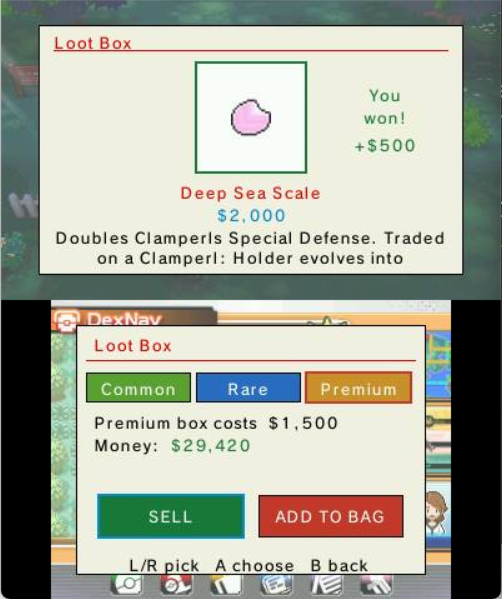
  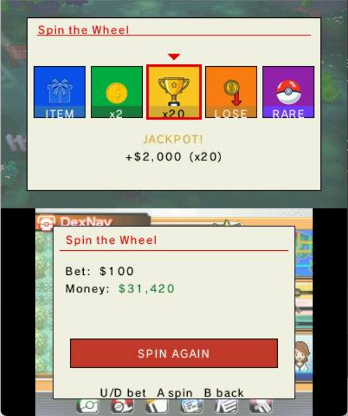
  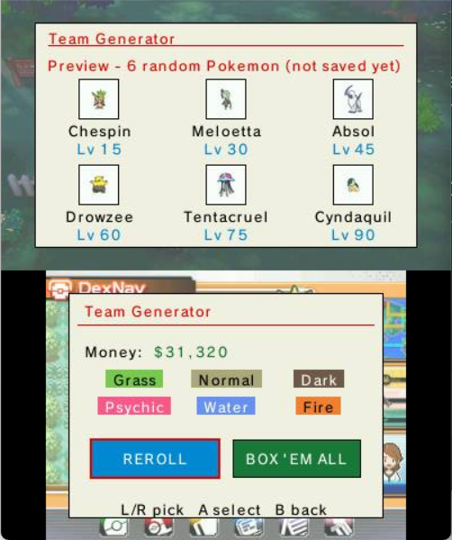
</p>

### Smooth the long journey

The **Overworld & Quality of Life** tools take the ache out of a long run — fast text, fast walk, teleport, walk
through walls, instant eggs and more. And a small, configurable **HUD** can keep your money, clock, map position
and lead's status right on screen while you play.

<p align="center">
  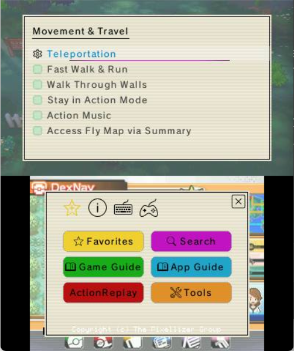
  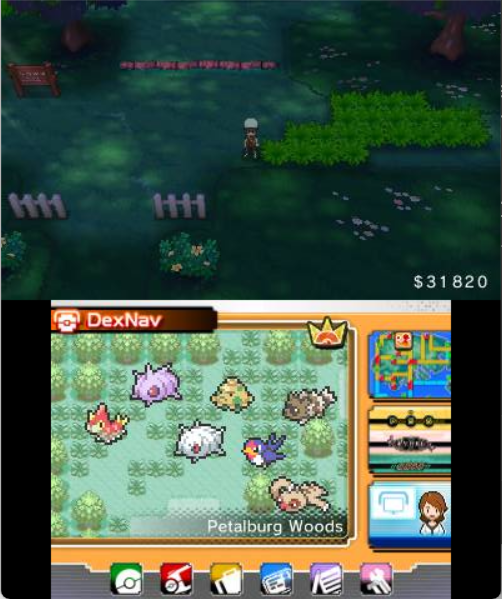
</p>

### Travel anywhere

**Teleportation** can drop you at any town, route or landmark in Hoenn — and, with a little teaching, exactly where
*you* like to stand. Pick a destination, then **HOLD L** and step into any door to warp there. The bottom screen
sorts every place into tabs — **All**, **Towns**, **Other** (Caves / Forests / Landmarks / Mirage Spots, as
sub-menus), **Routes** (101–134) and **Map**. **A** teleports, **Y** flips between the picture grid and a plain list,
and **X** jumps the selection to wherever you're standing right now.

<p align="center">
  
  
</p>

Two buttons make it your own: stand exactly where you want to arrive, then **Start = save warp point** (your precise
landing tile — this is also what makes a **route** teleportable) or **ZL = tag area** (teaches **X** the hidden
sub-maps it doesn't recognise yet). The **Map** tab is a living mini-map you *walk* with the D-Pad — town to route to
town, just like the real journey — and pressing **Y** there swaps it for a single picture-grid of *every* place
(towns + routes, no labels), laid out roughly like Hoenn and filterable by the chips along the bottom (tap more than
one). Everything you save lands in a hand-editable **MyTeleport.txt** in the plugin folder, and it survives updates.

<p align="center">
  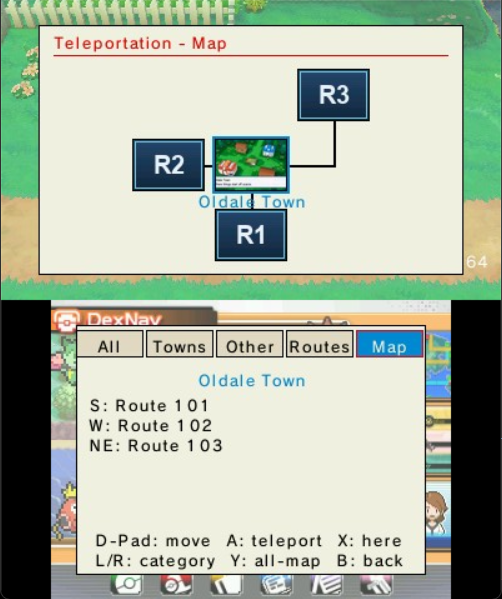
  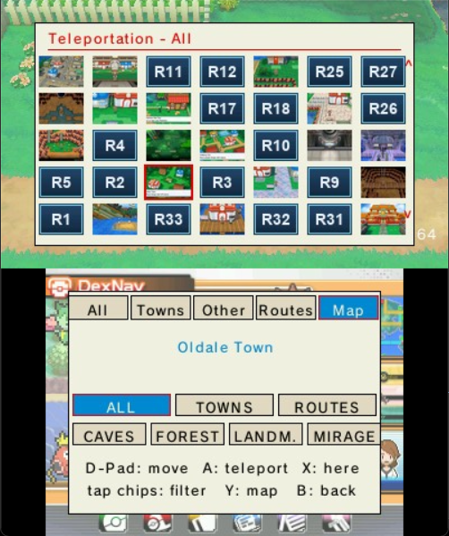
</p>

### Make it yours

Twenty-five color **themes** restyle the whole interface — menus, buttons, even the in-game keyboard — with a
preview swatch beside each name and your choice remembered between sessions. Pin your most-used features to
**Favorites** (two columns, drag to reorder), and rebind the menu keys in **Tools › Hotkeys**.

<p align="center">
  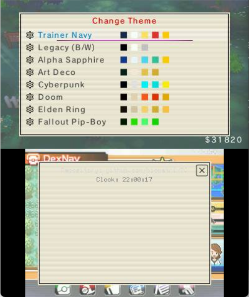
  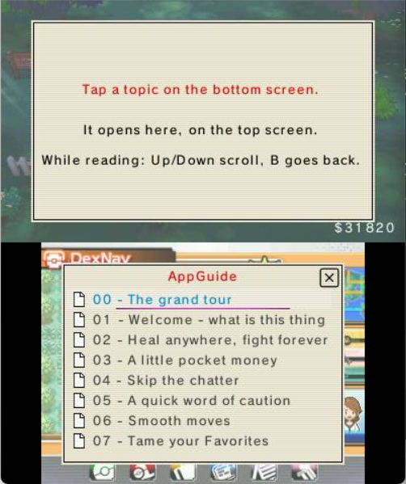
</p>

And if you ever feel lost, the **App Guide** (23 pages, written like a guided adventure rather than a manual) and an
**info (i) note on every single function** are always one button away.

## 📜 How it grew

A short history, newest last — no detail, just the shape of it:

- **v0.2.x** — the big UX overhaul: re-organised menus, Favorites, toasts, the HUD, and the first themes.
- **v0.3.0** — the dual-screen finders (Wild Pokémon Spawner, Respawn Legendary) and the App Guide.
- **v0.3.1** — **PokéMart Anywhere** (a real in-bag shop with prices, cart and checkout) + bag sorting.
- **v0.3.2** — capture the plugin's own UI in screenshots; favorites/cheats/hotkeys survive a plugin update.
- **v0.3.3** — **In-Battle Tools** (Enemy Helper, Change Party Stats), the visual **PC Box ++** editor, and the
  **Mini Game Corner**.
- **v0.4.2** — **Teleportation** reborn: a two-screen place picker with a navigable **Map** and a full picture-grid
  overview, your own saved **warp points** (the hand-editable `MyTeleport.txt`), and tidier plugin folders under
  **Assets/**.
- **v0.5.0** — **multi-game**: tailored content for all four Gen 6 titles (X, Y, Omega Ruby, Alpha Sapphire), a full Kalos teleport map, and the UI in **7 languages**.

## 📥 Installing

> 💻 **Also works on Citra emulator** — see the [On Citra](#on-citra) section below.

1. Update to the latest [Luma3DS](https://github.com/LumaTeam/Luma3DS/releases/latest).
2. Download the latest [release](https://github.com/samaBR85/Gen6CTRPFrameworkOverhauled/releases/latest).
3. Extract the `.zip` to the **root of your SD card**, keeping its folder layout. It adds two folders:
   - `luma/` — the plugin, with one folder per game: `luma/plugins/0004000000055D00/` (X), `0004000000055E00/` (Y), `000400000011C400/` (Omega Ruby), `000400000011C500/` (Alpha Sapphire). The same `Gen6CTRPluginFramework.3gx` (plus the built-in App Guide & Game Guide) sits in each; it auto-detects your game.
   - `Gen6CTRPluginFramework/` — the plugin's data, including the **language files** (English, French, German, Italian, Japanese, Portuguese (Brazil), Spanish — 7 languages). **This folder goes at the SD root, next to `luma/` — *not* inside it.** The plugin loads its language from here, so don't skip it. (Your `Theme.txt` and `HUD.txt` settings are created in this folder automatically on first run.)
4. Make sure `Gen6CTRPluginFramework.3gx` is the only `.3gx` file for the title.
5. Open the Rosalina menu (`L+Down+Select`) and set **Plugin Loader** to **[ENABLED]**.
6. Launch your Gen 6 game — Luma3DS loads the plugin on startup. Press **Select** in-game to open the menu, then open the **App Guide**.

> **Note:** The language pack must sit inside the `Gen6CTRPluginFramework` folder at the **root of your SD card**. Make sure the path is exactly:
> `SD:/Gen6CTRPluginFramework/Language/<Language>.txt`
> (for example `SD:/Gen6CTRPluginFramework/Language/English.txt`).

### On Citra

Citra natively supports 3GX plugins using the same folder structure as Luma3DS. Steps 1–2 are identical (download & extract). Then:

1. Open Citra and go to **File → Open Citra Folder** to find the User Directory.
2. Copy the extracted `luma/` and `Gen6CTRPluginFramework/` folders into the `sdmc/` subfolder inside that directory.
3. In Citra: **Emulation → Configure → System → Enable 3GX plugin loader**.
4. Launch your Gen 6 game — no Rosalina needed, the plugin loads automatically. Press **Select** to open the menu.

## 🔧 Building
1. Requires `devkitPro`.
2. Open `C:/devkitPro/msys2` and run `msys2_shell.bat`.
3. Add the ThePixellizerOSS repos (paste and run):
   ```sh
   if ! grep -Fxq "[thepixellizeross-lib]" /etc/pacman.conf; then echo -e "\n[thepixellizeross-lib]\nServer = https://thepixellizeross.gitlab.io/packages/any\nSigLevel = Optional" | tee -a /etc/pacman.conf > /dev/null; fi; if ! grep -Fxq "[thepixellizeross-win]" /etc/pacman.conf; then echo -e "\n[thepixellizeross-win]\nServer = https://thepixellizeross.gitlab.io/packages/x86_64/win\nSigLevel = Optional" | tee -a /etc/pacman.conf > /dev/null; fi
   ```
4. Run `pacman -Sy` and confirm the ThePixellizerOSS databases appear.
5. Run `Release.bat` in the plugin directory.

## 🙏 Credits

This project stands on a long line of volunteer work — from the very first ancestor to this fork — and
**every bit of it deserves recognition.** Without this community's freely given effort, none of this would exist.

**The plugin lineage**
- **Based on** [Gen 6 CTRPluginFramework](https://github.com/biometrix76/Gen6CTRPluginFramework) by
  [biometrix76](https://github.com/biometrix76) — built on
  [Alolan CTRPluginFramework](https://github.com/biometrix76/alolanctrpluginframework/releases/latest)
  and a continuation of the abandoned
  [Multi-Pokémon Framework](https://github.com/semaj14/Multi-PokemonFramework) and
  [its contributors](https://github.com/semaj14/Multi-PokemonFramework/blob/main/Credits.md).

**Foundations & tooling** (preserved from upstream)
- [ThePixellizerOSS](https://gitlab.com/thepixellizeross) et al. — the 3gxtool and CTRPluginFramework used to build plugins
- [PKHeX](https://github.com/kwsch/PKHeX/) (kwsch) et al. — database, documentation, examples, and code
- [AnalogMan151](https://github.com/AnalogMan151) — the ultraSuMoFramework foundation of Alolan CTRPluginFramework
- [dragonfyre173](https://github.com/dragonfyre173) — the in-game data viewer overlay
- [JourneyOver](https://github.com/JourneyOver) et al. — the extensive [ActionReplay code database](https://github.com/JourneyOver/CTRPF-AR-CHEAT-CODES)
- [Alexander Hartmann](https://github.com/Hartie95) — the XY & ORAS foundation of this plugin

**Image & data sources** (for the Spawner, item finder and Pokédex data)
- **Pokémon sprites** — the Spawner sprites and Legendary icons are downscaled from the
  [Pokémon Database](https://pokemondb.net) X/Y sprite set.
- **Item / TM / HM icons** — from the [PokéAPI sprites](https://github.com/PokeAPI/sprites) repository.
- **Pokédex, type, ability & move data** — [Pokémon Showdown](https://github.com/smogon/pokemon-showdown) and
  [PokéAPI](https://pokeapi.co); **item names** from [PKHeX](https://github.com/kwsch/PKHeX/) (kwsch).
- **Location & route images** — the Teleport map/route thumbnails and the area-connection data are from the
  [ORAS Wiki](https://oraswiki.com/locations/).
- **Kalos (X/Y) location images** — from [Bulbapedia](https://bulbapedia.bulbagarden.net/).
- All Pokémon images and names are **© Nintendo / Game Freak / The Pokémon Company.** These community mirrors
  are used only to build this free, non-commercial fan tool.

**The bundled Game Guide** — the Professor Oak Challenge walkthrough
- **Mewlax** ([u/mewlax84](https://www.reddit.com/user/mewlax84), Instagram [@pokemewlax](https://www.instagram.com/pokemewlax/),
  X [@Mewlax1](https://twitter.com/Mewlax1)) — author of the **ORAS and X/Y guides**, shared through the
  [r/ProfessorOak](https://www.reddit.com/r/ProfessorOak/) community.
- **Chamale** — first inspired the Professor Oak Challenge back in 2018.
- **Johnstone** and **Chaotic Meatball** — for helping the r/ProfessorOak community grow.
- **Dynamite** — for the O-Power order info; **Likemeon** — for the Granite Cave chaining tip.

**This fork**
- Fork, overhaul and v0.3.0 → v0.5.0 additions by [samaBR85](https://github.com/samaBR85), built in collaboration
  with **Claude** (Anthropic).

## License
Licensed under **GNU GPL-3.0**, inherited from upstream. See [LICENSE](LICENSE).
